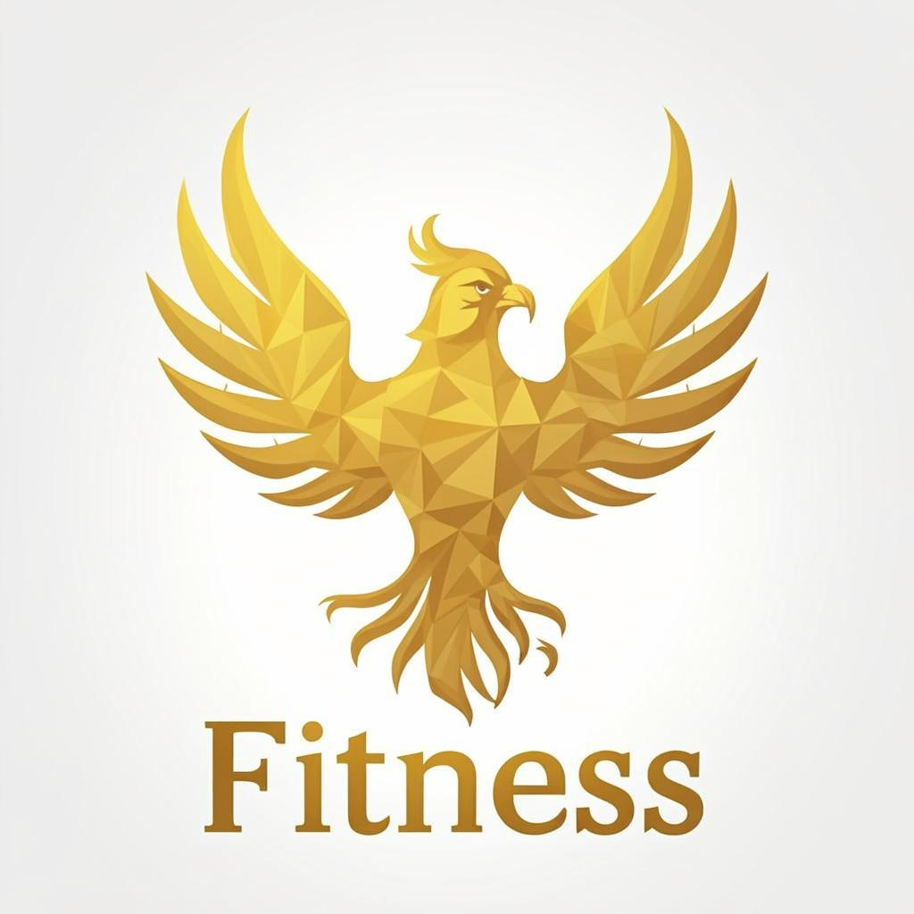

<p align="center">
  
</p>

<h1 align="center">FitnessForge</h1>

<p align="center">
  <b>Premium Full-Stack Fitness Website</b><br/>
  Built with Next.js · React · TypeScript · Tailwind CSS · Prisma · shadcn/ui
</p>

<p align="center">
  <a href="#features">Features</a> •
  <a href="#tech-stack">Tech Stack</a> •
  <a href="#installation">Installation</a> •
  <a href="#running-locally">Run Locally</a> •
  <a href="#deployment">Deploy</a> •
  <a href="#license">License</a>
</p>

---

## 📋 Overview

**FitnessForge** is a modern, premium fitness website with a responsive UI, smooth animations, and full-stack architecture. It features 30+ custom-built sections — from an interactive hero and class scheduler to a BMI calculator and workout planner — all powered by a scalable Next.js + Prisma backend with RESTful API routes.

This project was designed as a portfolio piece to demonstrate real-world frontend and backend development skills, with an emphasis on performance, accessibility, and polished design.

---

## 🌐 Live Demo

> 🔗 _Coming Soon_ — Deployment link will be added here once the project is live.

---

## ✨ Features

| Category | Highlights |
|---|---|
| **Hero & Navigation** | Animated hero section, sticky navbar, promotional strip, scroll progress tracker |
| **Classes & Scheduling** | Class cards, weekly class schedule, live class status indicator |
| **Trainers** | Trainer profiles, profile modals, trainer booking system |
| **Pricing** | Tiered pricing cards with feature comparison table |
| **Facilities** | Facility showcase with modern gallery component |
| **Transformations** | Before/after transformation slider, member spotlight |
| **Workout Tools** | Workout planner, exercise library, workout-of-the-day (WOD), workout timer |
| **Health Calculators** | BMI calculator, custom quote calculator |
| **Community** | Community section, fitness challenges, achievement badges |
| **Nutrition** | Nutrition tips section |
| **Engagement** | Testimonials carousel, FAQ accordion, newsletter popup, cookie consent |
| **Contact & Leads** | Contact form, free trial booking, WhatsApp float button, chat widget |
| **UX Extras** | Loading splash screen, back-to-top button, social proof notifications, scroll-reveal animations |
| **Backend API** | RESTful endpoints for contact inquiries, free trials, newsletter subscriptions, class bookings, and chat |
| **Database** | Prisma ORM with models for Users, Posts, Contact Inquiries, Free Trials, and Newsletters |

---

## 🛠 Tech Stack

| Layer | Technology |
|---|---|
| **Framework** | [Next.js 16](https://nextjs.org/) (App Router) |
| **Language** | [TypeScript 5](https://www.typescriptlang.org/) |
| **UI Library** | [React 19](https://react.dev/) |
| **Styling** | [Tailwind CSS 4](https://tailwindcss.com/) + `tailwindcss-animate` |
| **Component Library** | [shadcn/ui](https://ui.shadcn.com/) (Radix primitives) |
| **Animations** | [Framer Motion](https://www.framer.com/motion/) |
| **State Management** | [Zustand](https://zustand.docs.pmnd.rs/) |
| **Data Fetching** | [TanStack React Query](https://tanstack.com/query) |
| **Forms** | [React Hook Form](https://react-hook-form.com/) + [Zod](https://zod.dev/) validation |
| **ORM** | [Prisma](https://www.prisma.io/) (SQLite) |
| **Charts** | [Recharts](https://recharts.org/) |
| **Icons** | [Lucide React](https://lucide.dev/) |
| **Fonts** | Geist Sans & Geist Mono (via `next/font`) |
| **Notifications** | [Sonner](https://sonner.emilkowal.dev/) toast library |

---

## 📁 Folder Structure

```
FitnessForge/
├── prisma/
│   └── schema.prisma          # Database schema (User, Post, ContactInquiry, FreeTrial, Newsletter)
├── public/
│   └── images/                # Static assets and logos
├── src/
│   ├── app/
│   │   ├── api/               # API routes (contact, free-trial, newsletter, book-class, chat)
│   │   ├── globals.css        # Global styles and Tailwind config
│   │   ├── layout.tsx         # Root layout with metadata and fonts
│   │   └── page.tsx           # Main landing page (30+ sections)
│   ├── components/
│   │   ├── gym/               # 46 custom feature components (hero, pricing, trainers, etc.)
│   │   └── ui/                # 48 shadcn/ui primitives (button, dialog, card, tabs, etc.)
│   ├── hooks/                 # Custom hooks (use-mobile, use-toast)
│   └── lib/                   # Utilities (db client, cn helper)
├── .env                       # Environment variables
├── next.config.ts             # Next.js configuration
├── tailwind.config.ts         # Tailwind CSS configuration
├── tsconfig.json              # TypeScript configuration
├── components.json            # shadcn/ui configuration
└── package.json               # Dependencies and scripts
```

---

## 🚀 Installation

### Prerequisites

- **Node.js** ≥ 18.x
- **npm** ≥ 9.x (or use your preferred package manager)

### Steps

```bash
# 1. Clone the repository
git clone https://github.com/your-username/FitnessForge.git
cd FitnessForge

# 2. Install dependencies
npm install

# 3. Set up environment variables
cp .env.example .env
# Edit .env with your values (see section below)

# 4. Generate Prisma client
npx prisma generate

# 5. Push database schema
npx prisma db push
```

---

## 🔐 Environment Variables

Create a `.env` file in the project root:

```env
# Database — SQLite (default) or any Prisma-supported provider
DATABASE_URL="file:./dev.db"
```

> **Note:** The project uses SQLite by default for zero-config local development. You can switch to PostgreSQL or MySQL by updating the `provider` in `prisma/schema.prisma` and adjusting the `DATABASE_URL` accordingly.

---

## 💻 Running the Project Locally

```bash
# Start the development server
npm run dev
```

The app will be available at **http://localhost:3000**.

### Other Available Scripts

| Command | Description |
|---|---|
| `npm run dev` | Start development server on port 3000 |
| `npm run build` | Create production build |
| `npm run start` | Start production server |
| `npm run lint` | Run ESLint |
| `npm run db:push` | Push Prisma schema to database |
| `npm run db:generate` | Regenerate Prisma client |
| `npm run db:migrate` | Run Prisma migrations |
| `npm run db:reset` | Reset database and re-apply migrations |

---

## 🌍 Deployment

FitnessForge is optimized for deployment on **Vercel** (recommended for Next.js):

1. Push your repository to GitHub.
2. Import the project on [vercel.com](https://vercel.com).
3. Add your environment variables in the Vercel dashboard.
4. Deploy — Vercel auto-detects Next.js and handles the rest.

For other platforms (Railway, Render, AWS, etc.), use the production build:

```bash
npm run build
npm run start
```

> **Tip:** When deploying with a hosted database (e.g., PostgreSQL on Supabase or PlanetScale), update `prisma/schema.prisma` to use the appropriate provider and set the `DATABASE_URL` in your deployment environment.

---

## 📸 Screenshots / Preview

> _Screenshots will be added here once the project is deployed._

<!--
<p align="center">
  
  <br/><em>Hero Section</em>
</p>
-->

---

## 🔮 Future Improvements

- [ ] User authentication with NextAuth.js (Google, GitHub providers)
- [ ] Member dashboard with workout history and progress charts
- [ ] Payment integration (Stripe / Razorpay) for membership plans
- [ ] Admin panel for managing classes, trainers, and inquiries
- [ ] Blog / content section powered by MDX
- [ ] Push notifications for class reminders
- [ ] Dark / light theme toggle
- [ ] Internationalization (i18n) support
- [ ] End-to-end testing with Playwright

---

## 📄 License

This project is licensed under the [MIT License](LICENSE).

---

## 👤 Author

**Sayandip Guchait**

- GitHub: [@SayandipGuchait2006](https://github.com/SayandipGuchait2006)

---

<p align="center">
  Built with ❤️ and modern web technologies.<br/>
  <b>⭐ Star this repo if you found it useful!</b>
</p>
